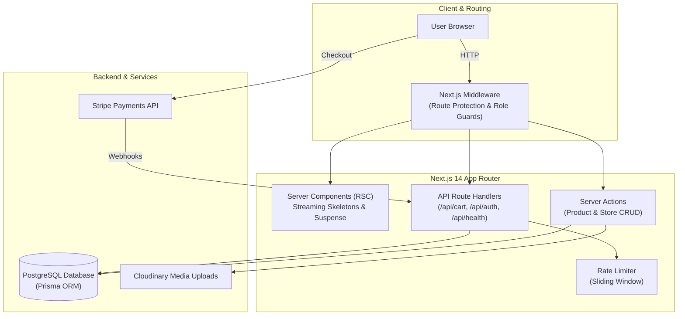

<div align="center">

# 🛒 BluE-Commerce

### A full-stack e-commerce store built with Next.js 14, PostgreSQL, Prisma, and Stripe checkout.


<h3><a href="https://blue-commerce-frknecn3.vercel.app" target="_blank"> Click Here to View Live Demo</a></h3>
<br>

[](.github/workflows/ci.yml)
[](https://nextjs.org)
[](https://www.typescriptlang.org)
[](https://vitest.dev)
[](https://www.postgresql.org)
[](Dockerfile)

</div>

---

## ⚡ Quick Demo Accounts

You can test both the customer and admin flows directly using the **One-Click Autofill Bar** on the `/login` page:

| Role | Email | Password | What to Test |
|---|---|---|---|
| 🛡️ **Admin** | `admin@bluecommerce.com` | `123456` | Access `/admin` dashboard, manage products, view user orders, update stock |
| 👤 **Customer** | `user@bluecommerce.com` | `123456` | Add to cart, save favorites, leave reviews, and test Stripe checkout |

---

## 💡 Why I Migrated from Firebase to PostgreSQL + Prisma

When I started this project, I used **Firebase Firestore** because it made scaffolding the frontend and authentication fast. But as I built out the store features (carts, inventory counts, store-seller links, and Stripe payments), a NoSQL document database started creating real headaches:

* **Orphaned data on deletes:** E-commerce data is relational. An order has items, and each item points to a product. In Firestore, if a product was deleted, broken references stayed behind in users' carts unless I wrote manual cleanup code for every collection.
* **Transactions were tricky:** When a customer completes checkout on Stripe, multiple things need to happen together: check remaining stock, decrement the inventory, mark the order paid, and empty the cart. In NoSQL, doing this across multiple collections without native database transactions left room for race conditions if two people bought the last item at once.
* **Complex queries required workarounds:** Filtering products by category, rating, and in-stock status at the same time meant either pulling too much data into JavaScript or running multiple sequential queries.

### Moving to PostgreSQL & Prisma

I rebuilt the data layer with **PostgreSQL** and **Prisma ORM**, which solved those issues directly:

1. **Foreign keys & cascade deletes:** Setting `@relation` and `onDelete: Cascade` means the database cleans up related records automatically.
2. **ACID transactions:** The Stripe webhook runs inside `prisma.$transaction(...)`. If stock runs out mid-checkout, the whole operation safely rolls back.
3. **Type safety from DB to UI:** Prisma generates TypeScript types straight from the schema, matching our Zod validators and frontend props.

---

## 🏛️ System Architecture



---

## ✨ Features

- **Product Catalog & Search:** Category navigation, live search, sorting by price/rating, and dynamic price filtering.
- **Cart & Wishlist:** Redux Toolkit state synced with server-side database persistence.
- **Stripe Checkout & Webhooks:** Embedded Stripe checkout with webhook event deduplication to prevent double charges or duplicate order fulfillment on network retries.
- **Inventory Protection:** Atomic stock decrements during checkout so products can't oversell.
- **Admin Dashboard:** Overview metrics, product management (create/edit/archive), user role checks, and store management.
- **Authentication & Security:** NextAuth.js credentials provider, bcrypt password hashing, input validation via Zod, rate limiting on auth endpoints, and edge middleware protecting `/admin` and `/checkout`.
- **Image Fallback System:** Universal image component that gracefully catches broken URLs and displays optimized placeholders.

---

## 🧪 Automated Testing

The project has **53 passing unit, integration, and end-to-end tests**:

```
✓ Zod runtime schemas (password rules, positive quantities, product shapes)
✓ Redux Toolkit reducers (cartSlice, favoriteSlice, uiSlice)
✓ Rate limiter sliding window behavior & IP header parsing
✓ Database health check (/api/health) & latency reporting
✓ Registration route (atomic transactions, batch cart writes, password sanitization)
✓ Playwright E2E browser flows (cart operations, admin route protection)
```

```bash
# Run Vitest unit & integration tests
npm test

# Run tests in watch mode
npm run test:watch

# Run Playwright End-to-End tests
npm run test:e2e
```

---

## 🐳 Docker Setup

You can run the full application with PostgreSQL using Docker Compose:

```bash
# Start the app and database
docker compose up -d

# View logs
docker compose logs -f

# Stop containers
docker compose down
```

---

## 🛠️ Local Development Setup

**Prerequisites:** Node.js 18+ (or 20+ / 22), PostgreSQL database

```bash
# 1. Clone repository
git clone https://github.com/frknecn3/blue-commerce.git
cd blue-commerce

# 2. Install dependencies
npm install

# 3. Configure environment variables
cp .env.example .env.local
# Add your DATABASE_URL, NEXTAUTH_SECRET, STRIPE_*, CLOUDINARY_*

# 4. Push schema & seed sample products
npx prisma db push
npm run seed

# 5. Run tests & typecheck
npm run typecheck
npm test

# 6. Start development server
npm run dev
```

---

## 🌐 Environment Variables

| Variable | Description |
|---|---|
| `DATABASE_URL` | PostgreSQL connection string |
| `NEXTAUTH_SECRET` | Random string for JWT session signing |
| `NEXTAUTH_URL` | App base URL (`http://localhost:3000`) |
| `STRIPE_SECRET_KEY` | Stripe API secret key |
| `STRIPE_WEBHOOK_SECRET` | Stripe webhook signing secret |
| `NEXT_PUBLIC_STRIPE_PUBLISHABLE_KEY` | Stripe publishable key |
| `CLOUDINARY_CLOUD_NAME` | Cloudinary account name for product images |
| `NEXT_PUBLIC_EMAILJS_PUBLIC_KEY` | EmailJS public key for activation emails |
| `EMAILJS_PRIVATE_KEY` | EmailJS private key |

---

<div align="center">

Feel free to check out the live demo using the one-click demo accounts on the login page! Suggestions and feedback are always welcome.

**[Launch Live Demo →](https://blue-commerce-frknecn3.vercel.app)**

</div>
