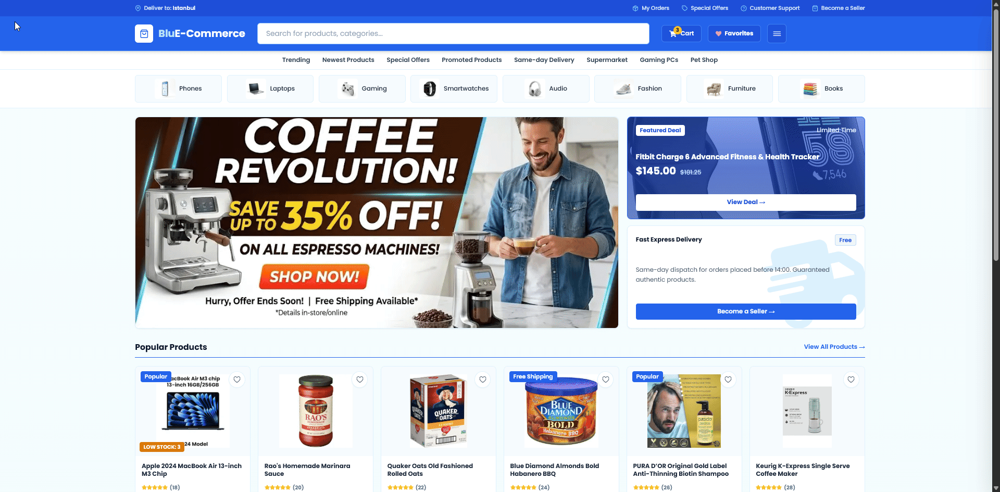
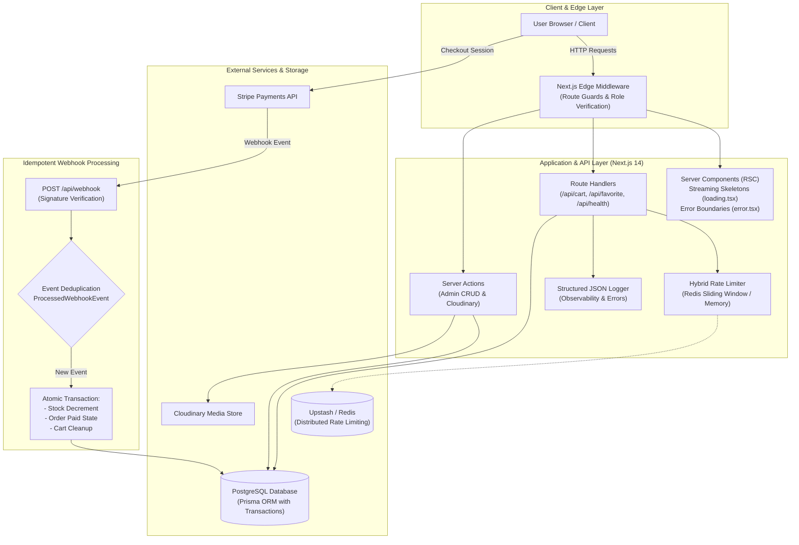

<div align="center">

# 🛒 BluE-Commerce

### A modern full-stack e-commerce platform featuring distributed rate limiting, webhook idempotency, end-to-end quality gates, and OWASP-hardened security.




<h3><a href="https://blue-commerce-frknecn3.vercel.app" target="_blank">🚀 CLICK HERE FOR LIVE DEMO</a></h3>
<br>

[](.github/workflows/ci.yml)
[](https://nextjs.org)
[](https://www.typescriptlang.org)
[-22c55e?style=for-the-badge&logo=vitest)](https://vitest.dev)
[](https://playwright.dev)
[](Dockerfile)
[](https://www.postgresql.org)
[](https://stripe.com)

</div>

---

## ⚡ Recruiter & Reviewer Quick Demo Access

The live application includes a **One-Click Autofill Bar** on `/login` to instantly explore both customer and administrative experiences:

| Role | Email | Password | Permissions & Features |
|---|---|---|---|
| 🛡️ **Admin** | `admin@bluecommerce.com` | `123456` | Access to `/admin` hub, catalog CRUD, metrics, and stock controls |
| 👤 **Customer** | `user@bluecommerce.com` | `123456` | Real-time Cart, Wishlist, Order history, and Stripe checkout |

---

## Behind the Architecture: Why I Migrated from Firebase to PostgreSQL + Prisma

When I first started building **BluE-Commerce**, I used **Firebase Firestore** because it made prototyping the UI and authentication fast. But as the application evolved into a full-featured e-commerce platform with carts, inventory counts, store-seller relationships, and Stripe payments, Firestore's document-based model quickly showed its limitations for this kind of domain:

- **Orphaned data on deletions:** E-commerce data is fundamentally relational. An order belongs to a user, contains line items, and each item points to a product under a specific store. In Firestore, if an admin deleted a product, stale references lingered in users' active carts and order histories unless I wrote manual cleanup code across multiple collections.
- **Transactions were fragile:** When a customer completes checkout via Stripe, multiple steps must succeed together: verify inventory, decrement stock, mark the order as paid, and clear the cart. Coordinating multi-document writes in NoSQL without native ACID guarantees felt risky and prone to race conditions during simultaneous checkouts.
- **Relational queries required workarounds:** Filtering by category, sorting by rating, and paginating with inventory filters simultaneously meant either making multiple sequential queries or pulling extra data to filter in JavaScript.

### The Move to PostgreSQL & Prisma

I decided to rebuild the entire persistence layer with **PostgreSQL** and **Prisma ORM**. It immediately simplified the codebase and solved all three problems:

1. **Foreign Keys & Cascade Deletions:** Relational constraints (`@relation`) and `onDelete: Cascade` guarantee that deleting an entity automatically cleans up related items. No more orphan cart rows or broken relations.
2. **True ACID Transactions:** Webhook order fulfillment now runs inside a unified `prisma.$transaction(...)`. If any step fails (e.g., an item sells out mid-payment), the entire operation rolls back safely.
3. **End-to-End Type Safety:** Prisma automatically generates strict TypeScript types directly from `schema.prisma`, syncing perfectly with our Zod validators and frontend props.

Rewriting the data layer gave the project the reliability, consistency, and structural integrity that a production commerce platform requires.

> 📖 *For a technical breakdown of the trade-offs, check out [ADR 001: Relational PostgreSQL Migration](docs/adr/001-relational-postgresql-migration.md).*

---

## System Architecture



---

## Architecture Decision Records (ADRs)

Key architectural trade-offs and decisions documented according to industry standards:

| ADR | Title | Key Architectural Rationale |
|---|---|---|
| [ADR 001](docs/adr/001-relational-postgresql-migration.md) | **NoSQL to PostgreSQL + Prisma** | Guaranteed ACID transactions, referential cascade constraints, and zero orphan order records. |
| [ADR 002](docs/adr/002-distributed-rate-limiting-in-serverless.md) | **Distributed Rate Limiting in Serverless** | Overcoming process isolation in serverless lambdas via Upstash Redis sliding window with memory fallback. |
| [ADR 003](docs/adr/003-webhook-idempotency-and-inventory-locks.md) | **Webhook Idempotency & Stock Concurrency** | Preventing duplicate fulfillment and stock anomalies via event tracking and atomic transaction locks. |

---

## ⚙️ Tech Stack & Capabilities

| Layer | Technology | Key Capabilities |
|---|---|---|
| **Framework** | Next.js 14 (App Router) | Server Components (RSC), Streaming Skeletons (`loading.tsx`), Error Boundaries (`error.tsx`), Schema.org JSON-LD |
| **Language** | TypeScript 5.x | Strict mode, End-to-end type safety, Zod schema validation |
| **Database** | PostgreSQL + Prisma ORM | Relational models, connection pooling, ACID transaction guarantees |
| **Testing** | Vitest + RTL + Playwright | 49 unit/integration tests and headless multi-browser E2E testing |
| **Authentication** | NextAuth.js v4 + Bcrypt | JWT strategy, role-based access control (`ADMIN` / `USER`), One-click demo fill |
| **Payments** | Stripe API | Server checkout sessions + cryptographic webhook verification & idempotency |
| **Observability** | `/api/health` + JSON Logger | Uptime metrics, DB latency monitoring, structured production logs |
| **DevOps & Tooling** | GitHub Actions + Docker + Husky | Automated CI/CD quality gate, multi-stage Docker container, pre-commit hooks, and Next.js bundle analyzer |
| **Security** | Hybrid Rate Limiter | Distributed Upstash Redis rate limiting with OWASP hardened headers |

---

## 🧪 Comprehensive Testing Suite (Vitest + Playwright)

This repository enforces high code quality through a complete testing pyramid:

```
┌─────────────────────────────────────────────────────────────┐
│ 1. End-to-End (E2E) Browser Tests (Playwright)              │
│    ✓ Guest cart persistence and navigation flow             │
│    ✓ Admin route protection and unauthorized redirects       │
│    ✓ Service health check connectivity verification         │
├─────────────────────────────────────────────────────────────┤
│ 2. Unit & Integration Tests (Vitest & RTL)                  │
│    ✓ Zod runtime schemas (passwords, CUID, product types)   │
│    ✓ Redux Toolkit reducers (cartSlice, favoriteSlice, ui)  │
│    ✓ Component steppers, stock caps, double-click guards    │
│    ✓ One-Click Demo Login autofill behavior verification    │
│    ✓ Sliding Window & Hybrid Rate Limiter verification      │
│    ✓ GET /api/health (DB latency ping & degraded state)     │
│    ✓ POST /api/auth/check-email & /api/favorite routes      │
└─────────────────────────────────────────────────────────────┘
```

### Running Tests Locally
```bash
# Run Vitest unit & integration tests (49 passing)
npm test

# Run Vitest in interactive watch mode
npm run test:watch

# Run Playwright End-to-End tests
npm run test:e2e

# Inspect client & server bundle sizes
npm run analyze
```

---

## 🛡️ Production Engineering & Security Rigor

- **Strict Webhook Idempotency**: Tracks incoming Stripe `event.id` in `ProcessedWebhookEvent` to eliminate duplicate payment fulfillment on network retries.
- **Atomic Stock Deduction**: Purchases decrement inventory levels (`stock: { decrement: quantity }`) inside `prisma.$transaction`.
- **Hybrid Rate Limiter**: Ephemeral serverless-resilient rate limiter (Redis REST in production, memory sliding-window in local dev).
- **Streaming Skeletons & Error Recovery**: Integrated `loading.tsx` shimmering skeletons and `error.tsx` client error boundaries for resilient UX.
- **Service Observability**: `/api/health` endpoint reporting database ping latency, Node memory usage, and uptime.
- **Structured JSON Logging**: Centralized logger formatted for CloudWatch/Datadog in production and readable output in development.
- **Automated Pre-Commit Quality Gate**: `husky` + `lint-staged` running ESLint and strict TypeScript checks on staged commits.
- **Hardened Security Headers**:
  - `Strict-Transport-Security` (HSTS)
  - `X-Frame-Options: SAMEORIGIN` (Clickjacking prevention)
  - `X-Content-Type-Options: nosniff` (MIME sniffing mitigation)
  - `Referrer-Policy: strict-origin-when-cross-origin`
  - `Permissions-Policy: camera=(), microphone=(), geolocation=()`

---

## 🐳 Docker & 1-Command Local Orchestration

You can run the entire production stack (App + PostgreSQL + Redis) with Docker Compose:

```bash
# Start PostgreSQL, Redis, and BluE-Commerce containers
docker compose up -d

# View container logs
docker compose logs -f

# Stop containers
docker compose down
```

---

## 🛠️ Local Development Setup

**Prerequisites:** Node.js 18+, PostgreSQL instance

```bash
# 1. Clone repository
git clone https://github.com/frknecn3/blue-commerce.git
cd blue-commerce

# 2. Install dependencies
npm install

# 3. Configure environment variables
cp .env.example .env.local
# Set: DATABASE_URL, NEXTAUTH_SECRET, NEXTAUTH_URL, STRIPE_*, CLOUDINARY_*, EMAILJS_*

# 4. Generate Prisma Client & push schema
npx prisma generate
npx prisma db push

# 5. Seed demo database (Admin & Demo Customer accounts)
npm run seed

# 6. Execute tests and typecheck
npm run typecheck
npm test

# 7. Start Next.js development server
npm run dev
```

---

## 🌐 Environment Variables Reference

| Variable | Description |
|---|---|
| `DATABASE_URL` | PostgreSQL connection URI |
| `NEXTAUTH_SECRET` | Secret key for JWT session signing |
| `NEXTAUTH_URL` | Base URL of the application (`http://localhost:3000`) |
| `STRIPE_SECRET_KEY` | Server-side Stripe API Secret Key |
| `STRIPE_WEBHOOK_SECRET` | Secret for verifying Stripe webhook signatures |
| `NEXT_PUBLIC_STRIPE_PUBLISHABLE_KEY` | Client-side publishable key |
| `UPSTASH_REDIS_REST_URL` | (Optional) Upstash Redis REST URL for distributed rate limiting |
| `UPSTASH_REDIS_REST_TOKEN` | (Optional) Upstash Redis REST Token |
| `NEXT_PUBLIC_EMAILJS_PUBLIC_KEY` | Public key for EmailJS activation emails |
| `EMAILJS_PRIVATE_KEY` | Private key for EmailJS server-side sending |
| `CLOUDINARY_CLOUD_NAME` | Cloudinary asset cloud name |

---

<div align="center">

Built with intentional architecture, type safety, and production-grade engineering standards.

**[Explore Live Demo →](https://blue-commerce-frknecn3.vercel.app)**

</div>
